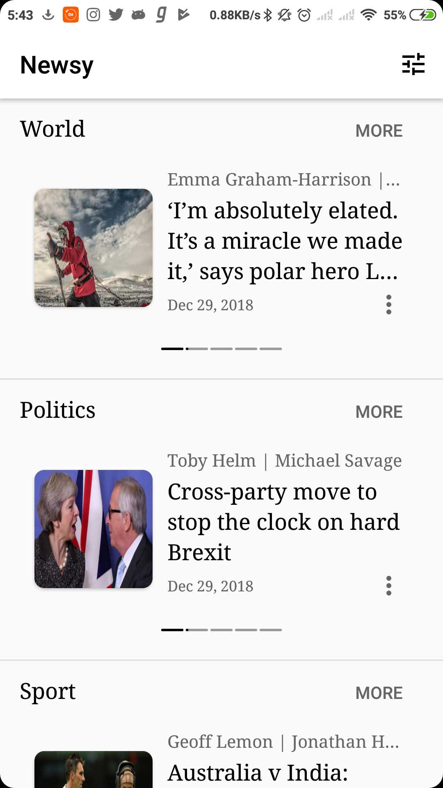
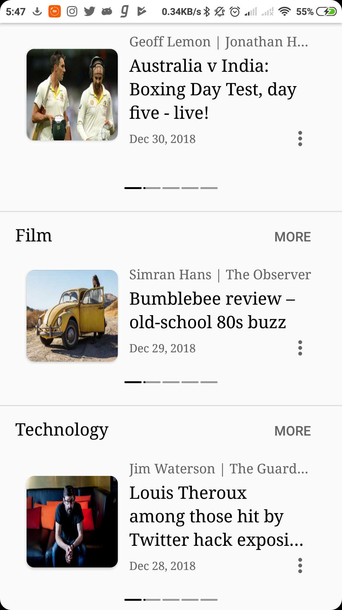

# Newsy
This app was made as a part of __Udacity's Basic Android Nanodegree__ under __Google India Challenge Scholarship__.
It is a basic news app that fetches latest news from [The Guardian API](https://open-platform.theguardian.com/) and display them.

## App Screenshots

    

